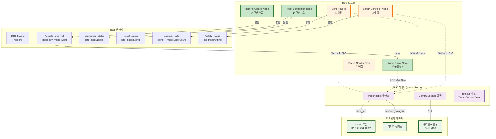
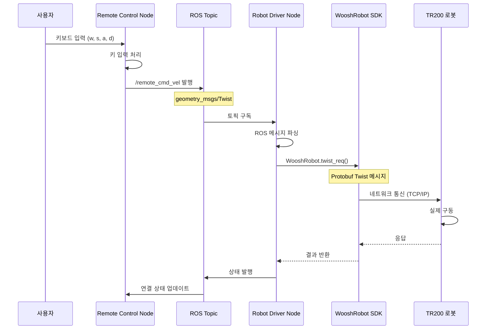

# TR200 ROS + SDK 통합 제어 시스템 프로젝트 계획

## 📋 프로젝트 개요

**목표**: TR200 로봇을 ROS Noetic 환경에서 SDK와 연동하여 센서 기반 안전 제어 시스템 구축

**환경**: 
- 호스트: Ubuntu 22.04 + ROS2 Humble
- 컨테이너: Ubuntu 20.04 + ROS Noetic (Docker)
- 로봇: TR200 (IP: 169.254.128.2, Port: 5480)

## 🏗️ 시스템 아키텍처

### 하이브리드 아키텍처 (ROS + SDK)

**현재 구현된 시스템은 ROS 구조와 SDK 함수를 결합한 하이브리드 방식입니다:**

- **ROS 생태계**: 노드 간 통신, 파라미터 관리, 로깅 시스템
- **SDK 레이어**: TR200 로봇과의 하드웨어 통신 및 제어
- **하드웨어 레이어**: 실제 TR200 로봇과 센서들

**장점:**
- ✅ ROS의 모듈화와 확장성 활용
- ✅ SDK의 안정적인 하드웨어 제어 활용
- ✅ 점진적 마이그레이션 가능
- ✅ 기존 SDK 기능을 그대로 유지



### 데이터 흐름 다이어그램



### 노드 구조도 (기존)
```
┌─────────────────┐    ┌─────────────────┐    ┌─────────────────┐
│   Robot Driver  │    │Safety Controller│    │   Sensor Node   │
│     Node        │◄───┤     Node        │◄───┤     Node        │
│                 │    │                 │    │                 │
└─────────────────┘    └─────────────────┘    └─────────────────┘
         ▲                       ▲                       ▲
         │                       │                       │
         ▼                       ▼                       ▼
┌─────────────────┐    ┌─────────────────┐    ┌─────────────────┐
│ Robot Connection│    │ Command Handler │    │ Status Monitor  │
│     Node        │    │     Node        │    │     Node        │
└─────────────────┘    └─────────────────┘    └─────────────────┘
         ▲                       ▲
         │                       │
         ▼                       ▼
┌─────────────────┐    ┌─────────────────┐
│ Remote Control  │    │ External Command│
│     Node        │    │     Node        │
└─────────────────┘    └─────────────────┘
```

### 하이브리드 아키텍처 특징

#### 🔄 ROS와 SDK의 역할 분담

| 레이어 | 담당 기능 | 사용 기술 |
|--------|-----------|-----------|
| **ROS 생태계** | 노드 간 통신, 파라미터 관리, 로깅 | rospy, 토픽, 서비스 |
| **SDK 레이어** | 하드웨어 제어, 프로토콜 통신 | WooshRobot, Protobuf |
| **하드웨어 레이어** | 실제 로봇 구동, 센서 데이터 | TR200, 라이다 센서 |

#### 🎯 구현된 노드들의 하이브리드 구조

**1. Robot Connection Node**
```python
# ROS 구조
rospy.init_node('robot_connection_node')
self.connection_status_pub = rospy.Publisher('/connection_status', Bool)

# SDK 활용
self.robot = WooshRobot(self.settings)
is_connected = self.robot.comm.is_connected()
```

**2. Robot Driver Node**
```python
# ROS 구조
self.cmd_vel_sub = rospy.Subscriber('/remote_cmd_vel', Twist, self.cmd_vel_callback)

# SDK 활용
await self.robot.twist_req(WooshTwist(linear=msg.linear.x, angular=msg.angular.z))
```

**3. Remote Control Node**
```python
# 순수 ROS 노드 (SDK 사용 안함)
self.cmd_vel_pub = rospy.Publisher('/remote_cmd_vel', Twist)
# 키보드 입력만 처리하고 ROS 토픽으로 발행
```

### ROS 토픽 구조
```
/cmd_vel          → 로봇 속도 명령 (geometry_msgs/Twist)
/scanner_data     → 라이다 센서 데이터 (sensor_msgs/LaserScan)
/robot_status     → 로봇 상태 정보 (std_msgs/String)
/safety_status    → 안전 상태 정보 (std_msgs/String)
/emergency_stop   → 비상 정지 신호 (std_msgs/Bool)
/remote_cmd_vel   → 원격 제어 명령 (geometry_msgs/Twist)
/external_cmd_vel → 외부 명령 (geometry_msgs/Twist)
/connection_status → 로봇 연결 상태 (std_msgs/Bool)
/system_status    → 시스템 상태 (std_msgs/String)
```

## 📁 프로젝트 구조

```
src/tr200_ros_control/
├── CMakeLists.txt
├── package.xml
├── README.md
├── REMOTE_CONTROL_GUIDE.md
├── launch/
│   ├── tr200_remote_control.launch      ✅ 통합 원격 제어 시스템
│   ├── tr200_base_system.launch         ✅ 기본 시스템 (연결 + 드라이버)
│   ├── tr200_keyboard_control.launch    ✅ 키보드 제어 전용
│   ├── tr200_keyboard_control_safe.launch ✅ 안전 모드 키보드 제어
│   ├── tr200_full_system.launch         (예정) 전체 시스템 실행
│   ├── tr200_safety_only.launch         (예정) 안전 제어만 실행
│   └── tr200_external_control.launch    (예정) 외부 제어만 실행
├── config/
│   ├── robot_params.yaml               ✅ 로봇 기본 설정
│   ├── safety_params.yaml              ✅ 안전 제어 설정
│   └── sensor_params.yaml               ✅ 센서 설정
├── scripts/
│   ├── robot_connection_node.py        ✅ 로봇 연결 관리
│   ├── robot_driver_node.py            ✅ 로봇 구동 제어
│   ├── remote_control_node.py          ✅ 키보드 원격 제어
│   ├── sensor_node.py                  (예정) 센서 데이터 처리
│   ├── safety_controller_node.py       (예정) 안전 제어 로직
│   ├── command_handler_node.py          (예정) 명령 처리
│   ├── external_command_node.py         (예정) 외부 명령 처리
│   └── status_monitor_node.py          (예정) 상태 모니터링
├── srv/
│   ├── SetSafetyParams.srv             ✅ 안전 파라미터 설정
│   └── GetRobotStatus.srv              ✅ 로봇 상태 조회
└── msg/
    ├── SafetyStatus.msg                ✅ 안전 상태 정보
    └── RobotStatus.msg                 ✅ 로봇 상태 정보
```

## 🎯 구현 계획

### Phase 1: 기본 인프라 구축 (1-2일)

#### 1.1 ROS 패키지 생성
- [x] `tr200_ros_control` 패키지 생성
- [x] CMakeLists.txt 및 package.xml 설정
- [x] 기본 디렉토리 구조 생성

#### 1.2 커스텀 메시지 및 서비스 정의
- [x] `SafetyStatus.msg` - 안전 상태 정보
- [x] `RobotStatus.msg` - 로봇 상태 정보  
- [x] `SetSafetyParams.srv` - 안전 파라미터 설정
- [x] `GetRobotStatus.srv` - 로봇 상태 조회

#### 1.3 설정 파일 생성
- [x] `robot_params.yaml` - 로봇 기본 설정
- [x] `safety_params.yaml` - 안전 제어 설정
- [x] `sensor_params.yaml` - 센서 설정

### Phase 2: 핵심 노드 구현 (3-4일)

#### 2.1 Robot Connection Node (`robot_connection_node.py`)
**기능**: TR200 로봇과의 SDK 연결 관리
- [x] WooshRobot SDK 초기화
- [x] 연결 상태 모니터링
- [x] 연결 재시도 로직
- [x] 연결 상태 토픽 발행
- [x] 연결 로그 중복 방지 기능

**입력**: 없음
**출력**: `/connection_status` (std_msgs/Bool)

#### 2.2 Sensor Node (`sensor_node.py`)
**기능**: 라이다 센서 데이터 수집 및 전처리
- [ ] 스캐너 데이터 구독
- [ ] 전방/후방 센서 데이터 분리
- [ ] 센서 데이터 전처리 및 필터링
- [ ] ROS LaserScan 메시지로 변환

**입력**: SDK 스캐너 데이터
**출력**: `/scanner_data` (sensor_msgs/LaserScan)

#### 2.3 Robot Driver Node (`robot_driver_node.py`)
**기능**: 로봇 구동 제어
- [x] `/remote_cmd_vel` 토픽 구독
- [x] SDK twist_req 호출
- [x] 속도 제한 및 안전 검사
- [x] 구동 상태 피드백
- [x] 연결 상태 모니터링
- [x] 비상 정지 지원

**입력**: `/remote_cmd_vel` (geometry_msgs/Twist)
**출력**: `/robot_driver_status` (std_msgs/String)

#### 2.4 Safety Controller Node (`safety_controller_node.py`)
**기능**: 센서 기반 안전 제어 로직
- [ ] `/scanner_data` 토픽 구독
- [ ] 장애물 감지 알고리즘
- [ ] 안전 거리 계산
- [ ] 비상 정지 로직
- [ ] 안전 상태 토픽 발행

**입력**: `/scanner_data` (sensor_msgs/LaserScan)
**출력**: 
- `/safety_status` (std_msgs/String)
- `/emergency_stop` (std_msgs/Bool)
- `/cmd_vel` (geometry_msgs/Twist) - 안전 제어된 속도

#### 2.5 Command Handler Node (`command_handler_node.py`)
**기능**: 다양한 입력 방식 지원
- [ ] 키보드 입력 처리 (teleop_twist_keyboard 스타일)
- [ ] 외부 토픽 명령 처리
- [ ] 명령 우선순위 관리
- [ ] 명령 검증 및 필터링

**입력**: 
- 키보드 입력
- 외부 토픽 명령
**출력**: `/cmd_vel` (geometry_msgs/Twist)

#### 2.6 Remote Control Node (`remote_control_node.py`)
**기능**: 노트북에서 키보드 입력을 통한 원격 제어
- [x] 키보드 입력 처리 (teleop_twist_keyboard 스타일)
- [x] 네트워크를 통한 원격 명령 전송
- [x] 연결 상태 모니터링
- [x] 명령 우선순위 관리
- [x] 단계별 속도 조절 기능 (개발용 안전 모드)
- [x] 실시간 속도 레벨 변경 (+/- 키)
- [x] 연결 로그 중복 방지 기능

**입력**: 키보드 입력
**출력**: `/remote_cmd_vel` (geometry_msgs/Twist)

#### 2.7 External Command Node (`external_command_node.py`)
**기능**: 외부 시스템으로부터의 명령 처리
- [ ] 외부 토픽 명령 수신
- [ ] 명령 검증 및 필터링
- [ ] 명령 우선순위 관리
- [ ] 명령 로깅

**입력**: 외부 토픽 명령
**출력**: `/external_cmd_vel` (geometry_msgs/Twist)

#### 2.8 Status Monitor Node (`status_monitor_node.py`)
**기능**: 시스템 상태 모니터링 및 로깅
- [ ] 모든 노드 상태 모니터링
- [ ] 센서 데이터 품질 검사
- [ ] 시스템 성능 모니터링
- [ ] 로그 파일 관리

**입력**: 모든 상태 토픽
**출력**: `/system_status` (std_msgs/String)

### Phase 3: 통합 및 테스트 (2-3일)

#### 3.1 Launch 파일 생성
- [x] `tr200_remote_control.launch` - 통합 원격 제어 시스템
- [x] `tr200_base_system.launch` - 기본 시스템 (연결 + 드라이버)
- [x] `tr200_keyboard_control.launch` - 키보드 제어 전용
- [x] `tr200_keyboard_control_safe.launch` - 안전 모드 키보드 제어
- [ ] `tr200_full_system.launch` - 전체 시스템 실행
- [ ] `tr200_safety_only.launch` - 안전 제어만 실행
- [ ] `tr200_external_control.launch` - 외부 제어만 실행

#### 3.2 통합 테스트
- [ ] 단위 테스트 (각 노드별)
- [ ] 통합 테스트 (전체 시스템)
- [ ] 안전성 테스트 (장애물 감지)
- [ ] 성능 테스트 (지연시간, CPU 사용률)

#### 3.3 문서화
- [ ] 사용자 매뉴얼 작성
- [ ] API 문서 작성
- [ ] 트러블슈팅 가이드 작성

## 🔧 개발 환경 설정

### Docker 환경 사용법
```bash
# 1. 컨테이너 실행 (첫 번째 터미널)
./scripts/run_container.sh

# 2. ROS 마스터 실행
roscore

# 3. 추가 터미널 접속 (두 번째 터미널)
./scripts/connect_container.sh

# 4. 패키지 빌드
cd /catkin_ws
catkin_make

# 5. 환경 설정
source devel/setup.bash
```

### 개발 순서
1. **기본 패키지 구조 생성** ✅
2. **Robot Connection Node 구현 및 테스트** ✅
3. **Robot Driver Node 구현 및 테스트** ✅
4. **Remote Control Node 구현 및 테스트** ✅
5. **기본 Launch 파일 생성 및 통합 테스트** ✅
6. **Sensor Node 구현 및 테스트**
7. **Safety Controller Node 구현 및 테스트**
8. **Command Handler Node 구현 및 테스트**
9. **External Command Node 구현 및 테스트**
10. **Status Monitor Node 구현 및 테스트**
11. **전체 시스템 Launch 파일 생성 및 최종 통합 테스트**

## 📊 성능 목표

- **지연시간**: 센서 데이터 수신부터 제어 명령 전송까지 < 100ms
- **안정성**: 24시간 연속 운영 가능
- **정확도**: 장애물 감지 정확도 > 95%
- **반응성**: 비상 정지 반응시간 < 50ms

## 🚨 안전 고려사항

- **Fail-Safe**: 센서 데이터 손실 시 자동 정지
- **Redundancy**: 다중 센서 데이터 검증
- **Emergency Stop**: 하드웨어/소프트웨어 비상 정지
- **Parameter Validation**: 모든 입력 파라미터 검증
- **Logging**: 모든 안전 관련 이벤트 로깅

## 🎮 현재 구현된 기능

### ✅ 완성된 키보드 제어 시스템
- **분리된 실행 구조**: 기본 시스템과 키보드 제어를 별도 터미널에서 실행
- **안전한 개발 모드**: 단계별 속도 조절 (레벨 1-3)
- **실시간 속도 조절**: `+`/`-` 키로 속도 증가/감소
- **직접 속도 선택**: `1`/`2`/`3` 키로 속도 레벨 직접 선택
- **연결 상태 모니터링**: 로봇 연결 상태 실시간 확인
- **로그 최적화**: 연결 상태 로그 중복 방지

### 🚀 사용 가능한 런치 파일
1. **`tr200_base_system.launch`**: 기본 시스템 (연결 + 드라이버)
2. **`tr200_keyboard_control.launch`**: 키보드 제어 (안전 모드 기본값)
3. **`tr200_keyboard_control_safe.launch`**: 초안전 모드
4. **`tr200_remote_control.launch`**: 통합 시스템

### 🎯 키보드 제어 명령어
```
이동 제어: w(전진), s(후진), a(좌회전), d(우회전), q(제자리 좌회전), e(제자리 우회전)
속도 조절: +(증가), -(감소), 1(매우 느림), 2(느림), 3(보통)
특수 명령: 스페이스(정지), x(비상정지), h(도움말), c(상태확인)
```

## 📈 향후 확장 계획

- **SLAM 통합**: 지도 생성 및 경로 계획
- **AI 기반 제어**: 머신러닝 기반 장애물 회피
- **다중 로봇**: 여러 TR200 로봇 협업
- **웹 인터페이스**: 원격 모니터링 및 제어

## 📝 진행 상황 추적

### 완료된 작업
- [x] 프로젝트 계획 수립
- [x] 시스템 아키텍처 설계
- [x] 노드 구조 정의
- [x] 기본 패키지 구조 생성 (tr200_ros_control)
- [x] 커스텀 메시지 및 서비스 정의
- [x] 설정 파일 생성
- [x] Robot Connection Node 구현 및 테스트
- [x] Robot Driver Node 구현 및 테스트
- [x] Remote Control Node 구현 및 테스트
- [x] 기본 런치 파일 생성 및 통합 테스트
- [x] 개발용 안전 모드 구현 (단계별 속도 조절)
- [x] 키보드 제어 시스템 완성
- [x] 연결 상태 로그 중복 방지 기능

### 진행 중인 작업
- [ ] Sensor Node 구현
- [ ] Safety Controller Node 구현

### 예정된 작업
- [ ] Command Handler Node 구현
- [ ] External Command Node 구현
- [ ] Status Monitor Node 구현
- [ ] 전체 시스템 Launch 파일 생성
- [ ] Phase 3: 통합 및 테스트

---

**프로젝트 시작일**: 2025년 09월 25일
**예상 완료일**: 2025년 12월 26일
**담당자**: User (KATECH 연구원)

> 이 문서는 프로젝트 진행에 따라 지속적으로 업데이트됩니다.
